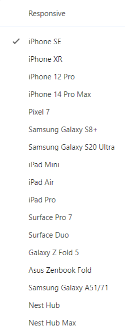
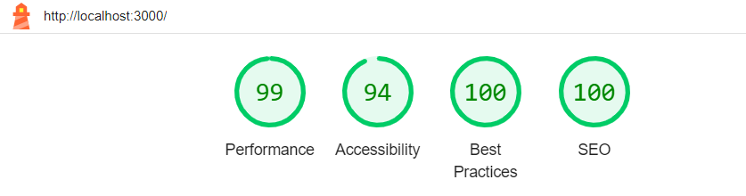

# Feefo: UI Technical Assessment

From the design was implemented in react.

  

## The application fulfils the following requirements
- The layout should grow/shrink sensibly with the viewport
- The design split into several components
- Usage of `proptypes`
- Unit tests covering your components
- a11y considered and relevant ARIA attributes added
- Assets for the font in the design (roboto) have been included via google fonts
- Font Awesome icons are available via the Font Awesome React bindings (there is a usage example in `account-overview.jsx`)
- The repository is set up to work with `styled-components` if you feel comfortable doing so, please use this instead of css
- The repository is set up to use jest + testing library for unit tests

## Responsiveness

Was tested for the following devices and the viewport's natural adaptations

  

## Accessibility and performance 

[Lighthouse](https://chromewebstore.google.com/detail/lighthouse/blipmdconlkpinefehnmjammfjpmpbjk?hl=pt-br), an open-source, automated tool for improving the performance, quality, and correctness of your web apps, was used to test the application's accessibility and performance

  

## Setup
1. Run `npm install` to install required dependencies
2. Run `npm run start` to start a local development server

## Available Scripts

In the project directory, you can run:

### `npm start`

Runs the app in the development mode.\
Open [http://localhost:3000](http://localhost:3000) to view it in the browser.

The page will reload if you make edits.\
You will also see any lint errors in the console.

### `npm test`

Launches the test runner in the interactive watch mode.\
See the section about [running tests](https://facebook.github.io/create-react-app/docs/running-tests) for more information.
